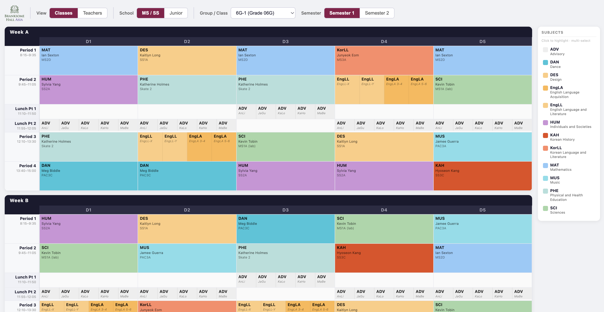
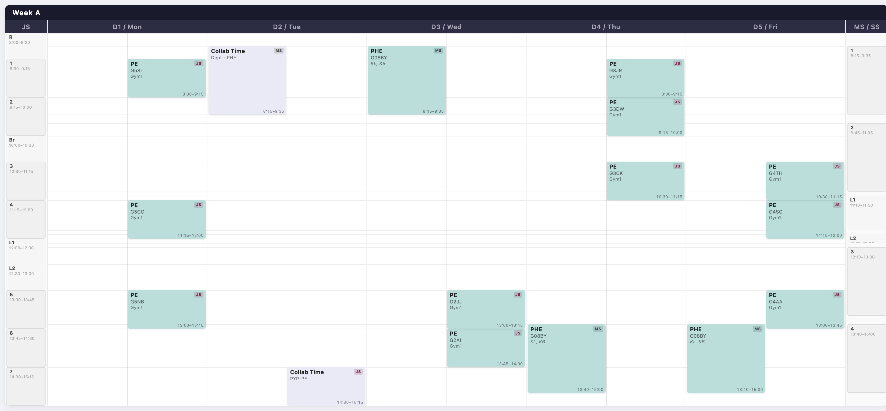

# Timetable Display

A Google Apps Script web app that reads aSc Timetables XML exports from Google Drive and renders an interactive timetable viewer.

Displays two different scheduling structures within a single application.


Combines different schedule structures into a single view for teachers who teach across sections.

**This was one of the primary motivators for building this, because of the challenge of building a non-conflicting schedule. As you can see from this screenshot - that problem is still not yet resolved, but I can at least _see_ it clearly now!**

Built using Claude Code, which enabled me to bring to life a concept I've had for years! A lot of the explanation below is directly Claude Code.


## Tech stack

| Layer | Technology |
|---|---|
| Backend | Google Apps Script (`Code.gs`) |
| Frontend | Single-page HTML/CSS/JS app (`Index.html`) |
| Data source | Two XML files on a Shared Drive folder plus a favicon logo file |
| Hosting | Apps Script web app deployment (served via `doGet()`) |

The frontend calls the backend exclusively via `google.script.run`. All three data sources (MSSS schedule, JS schedule, teacher data) are fetched in parallel at startup so every subsequent view or school switch is an instant client-side re-render.
> [!Note]
> It does take a while to load on run/refresh. But then it is FAST!

## Features

### Class view
- **MS / SS school** (MSSS Schedule.xml): Grades 6–12
  - Grades 6–9: travelling-group selector (BY groups and digit-clustered TGs)
  - Grades 10–12: whole-class view with simultaneous elective splits shown as horizontal sub-slots
  - A/B week, Semester 1 / Semester 2 toggle
- **Junior School** (JS Schedule.xml): JK / SK / Grades 1–5
  - Class-based selector, single-week schema
- Subject legend sidebar with click-to-highlight multi-select filter

### Teacher view
- Unified timeline for all staff across both schools
- For teachers in both schools: day columns split left (MS) / right (JS), so scheduling conflicts are immediately visible
- Period reference strips on each side (JS left, MS/SS right) — each period shown as a sized card positioned by real clock time, making cross-school period alignment easy to read
- Lesson cards show subject, class(es), group(s), room, and time range
- Semester 1 / 2 toggle; ↻ Refresh button to bust the 6-hour server-side cache

## Configuration

All deployment-specific values are stored in **Script Properties**, not in code. This means the same codebase works for any deployment without modification — each instance just has its own properties.

To configure a new deployment:

1. Open the project in the Apps Script editor
2. Run `setupConfig()` once from the editor — this seeds placeholder values
3. Go to **Project Settings → Script Properties** and set the real values:

| Property | Description |
|---|---|
| `TIMETABLE_FOLDER_ID` | ID of the Drive folder containing the XML files (from the folder URL) |
| `MSSS_FILENAME` | Filename of the Middle/Senior School XML (default: `MSSS Schedule.xml`) |
| `JS_FILENAME` | Filename of the Junior School XML (default: `JS Schedule.xml`) |
| `FAVICON_URL` | Optional — direct image URL for the browser tab favicon. Leave blank for none. |
| `LOGO_URL` | Optional — direct image URL for the school logo shown in the toolbar. Leave blank for none. |
| `LOGO_ALT` | Alt text for the logo (default: `School logo`). |

XML files are excluded from this repo — upload them to your Drive folder and keep filenames matching the properties above.

## Setup on a new machine

1. **Install clasp** (Google's Apps Script CLI):
   ```
   npm install -g @google/clasp
   ```
2. **Authenticate**:
   ```
   clasp login
   ```
3. **Create a `.clasp.json`** in the project root pointing to your Apps Script project:
   ```json
   { "scriptId": "YOUR_SCRIPT_ID", "rootDir": "." }
   ```
4. **Push code** to the script editor:
   ```
   clasp push --force
   ```
5. **Run `setupConfig()`** from the Apps Script editor, then set real values in Project Settings → Script Properties.
6. **Deploy** in the Apps Script UI:
   - **Deploy → Manage deployments → Edit (pencil) → Version: New version → Deploy**
   - The deployment URL stays the same; the new version is now live.

## Deployment rules

- **Only ever use `clasp push`** to update code. Never run `clasp deploy` from the CLI — it resets the deployment configuration and breaks the web app. Always create new deployment versions through the Apps Script UI.

## Project structure

```
Code.js          — Apps Script backend: XML parsing, grid builder, teacher schedule builder, caching
Index.html       — Frontend SPA: class grid view, teacher timeline view, controls, legend
appsscript.json  — Apps Script manifest (timezone, runtime)
```

