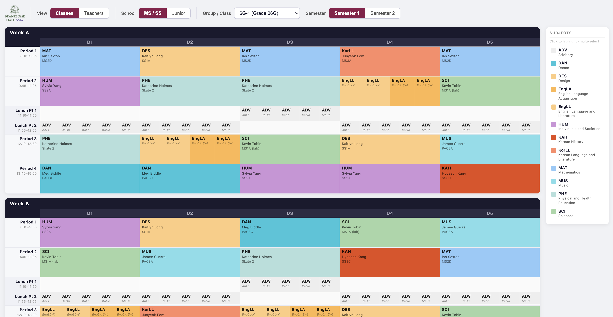
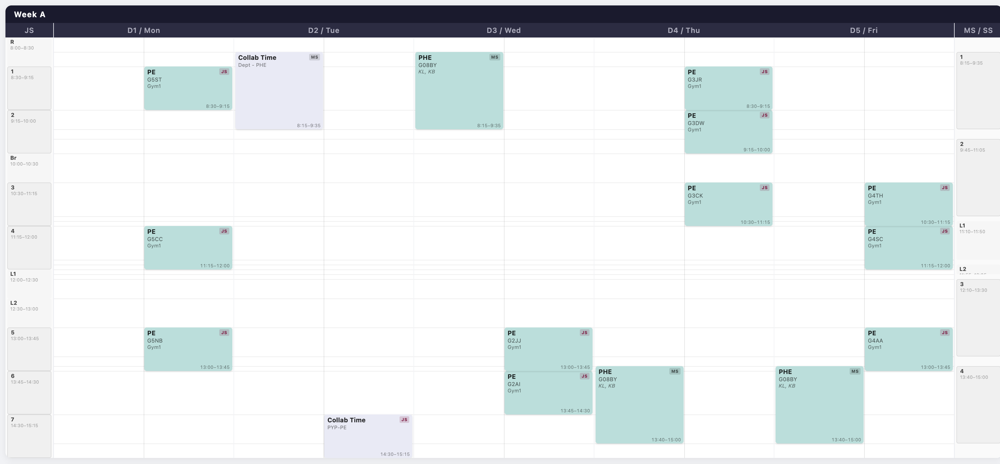

# Timetable Display

A Google Apps Script web app that reads aSc Timetables XML exports from Google Drive and renders an interactive timetable viewer.

Displays two different scheduling structures within a single application.


Combines different schedule structures into a single view for teachers who teach across sections.

**This was one of the primary motivators for building this, because of the challenge of building a non-conflicting schedule. As you can see from this screenshot - that problem is still not yet resolved, but I can at least _see_ it clearly now!**

Built using Claude Code, which enabled me to bring to life a concept I've had for years! A lot of the explanation below is directly Claude Code.


## Tech stack

| Layer | Technology |
|---|---|
| Backend | Google Apps Script (`Code.js`) |
| Frontend | Single-page HTML/CSS/JS app (`Index.html`) |
| Data source | Two XML files on a Shared Drive folder plus a favicon logo file |
| Hosting | Apps Script web app deployment (served via `doGet()`) |
| Tests | Node's built-in test runner (`npm test`) — dev-only, never deployed |

The frontend calls the backend exclusively via `google.script.run`. All five data sources (MSSS schedule, JS schedule, teacher/subject/room data) are fetched in parallel at startup so every subsequent view or school switch is an instant client-side re-render.
> [!Note]
> It does take a while to load on run/refresh. But then it is FAST!

## Features

Four views, switchable from the always-visible top bar (which stays pinned in place as you scroll):

### Classes
- **MS / SS school** (MSSS Schedule.xml): Grades 6–12
  - Grades 6–9: travelling-group selector (BY groups and digit-clustered TGs)
  - Grades 10–12: whole-class view with simultaneous elective splits shown as horizontal sub-slots
  - A/B week, Semester 1 / Semester 2 toggle
- **Junior School** (JS Schedule.xml): JK / SK / Grades 1–5
  - Class-based selector, single-week schema
- Subject legend sidebar with click-to-highlight multi-select filter
- Prev/next arrows to step through the Group/Class list without touching the dropdown

### Teachers, Subjects, Rooms
Three parallel timeline views, each built the same way — pick one from a searchable dropdown (with prev/next arrows and an All / JS / MS-SS filter), see its full weekly schedule:
- **Teachers** — every staff member's timeline across both schools
- **Subjects** — every occurrence of a subject across whichever teachers and classes teach it
- **Rooms** — everything booked into a given classroom

An entity taught/booked at both schools gets a split day column (left = JS, right = MS/SS) so scheduling conflicts are immediately visible; period reference strips on each side position every period by real clock time for easy cross-school comparison. Concurrent same-time sessions (e.g. Advisory, where every homeroom meets at once under a different teacher) collapse into a single "N sessions" card — click it to see the full list rather than a pile of hidden, overlapping blocks.

Semester 1 / 2 toggle and a ↻ Refresh button (busts the 6-hour server-side cache) apply throughout.

## Configuration

All deployment-specific values are stored in **Script Properties**, not in code. This means the same codebase works for any deployment without modification — each instance just has its own properties.

To configure a new deployment:

1. Open the project in the Apps Script editor
2. Run `setupConfig()` once from the editor — this seeds placeholder values
3. Go to **Project Settings → Script Properties** and set the real values:

| Property | Description |
|---|---|
| `TIMETABLE_FOLDER_ID` | ID of the Drive folder containing the XML files (from the folder URL) |
| `MSSS_FILENAME` | Filename of the Middle/Senior School XML (default: `MSSS Schedule.xml`) |
| `JS_FILENAME` | Filename of the Junior School XML (default: `JS Schedule.xml`) |
| `FAVICON_URL` | Optional — direct image URL for the browser tab favicon. Leave blank for none. |
| `LOGO_URL` | Optional — direct image URL for the school logo shown in the toolbar. Leave blank for none. |
| `LOGO_ALT` | Alt text for the logo (default: `School logo`). |

XML files are excluded from this repo — upload them to your Drive folder and keep filenames matching the properties above.

## Setup on a new machine

1. **Install clasp** (Google's Apps Script CLI):
   ```
   npm install -g @google/clasp
   ```
2. **Authenticate**:
   ```
   clasp login
   ```
3. **Create a `.clasp.json`** in the project root pointing to your Apps Script project:
   ```json
   { "scriptId": "YOUR_SCRIPT_ID", "rootDir": "." }
   ```
4. **Push code** to the script editor:
   ```
   clasp push --force
   ```
5. **Run `setupConfig()`** from the Apps Script editor, then set real values in Project Settings → Script Properties.
6. **Deploy** in the Apps Script UI:
   - **Deploy → Manage deployments → Edit (pencil) → Version: New version → Deploy**
   - The deployment URL stays the same; the new version is now live.

## Deployment rules

- **Only ever use `clasp push`** to update code. Never run `clasp deploy` from the CLI — it resets the deployment configuration and breaks the web app. Always create new deployment versions through the Apps Script UI.

## Project structure

```
Code.js          — Apps Script backend: XML parsing, grid builder, teacher/subject/room schedule builders, caching
Index.html       — Frontend SPA: class grid view, teacher/subject/room timeline views, controls, legend
appsscript.json  — Apps Script manifest (timezone, runtime)
test/            — Node test suite (npm test) — dev-only, .claspignore excludes it from deployment
```

## Potential future enhancements

- **Duty scheduling** — aSc Timetables can export duty assignments (yard duty, gate duty, etc.) alongside teaching periods. The XML schema already supports duty records, so a future iteration could parse and display them in the "Who is teaching?" view as an additional row per period. This would let Principals see not only which class each teacher is running but also who is on duty in which location — without any changes to the underlying data source.

## Testing

`npm test` runs a dependency-free Node test suite over the pure-logic parts of both files — no build step, and nothing here is ever pushed to Apps Script. See `CLAUDE.md` for what's covered and why the rest (anything touching `XmlService`, Drive, or the DOM) is verified by hand on `/dev` instead.

